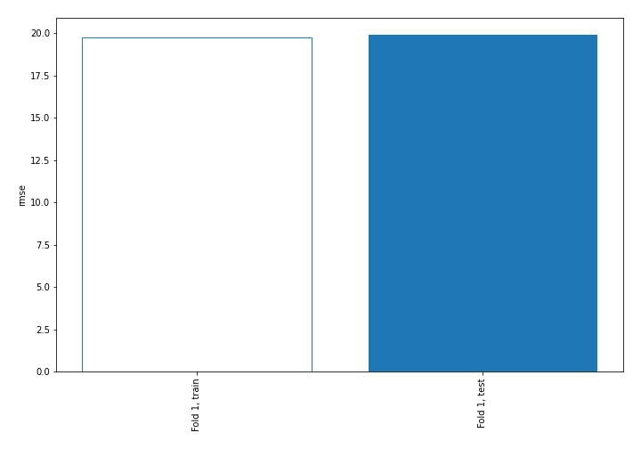
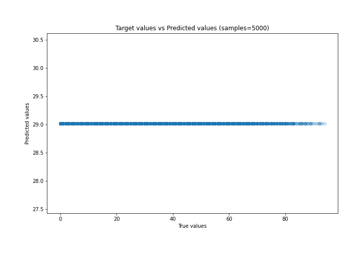
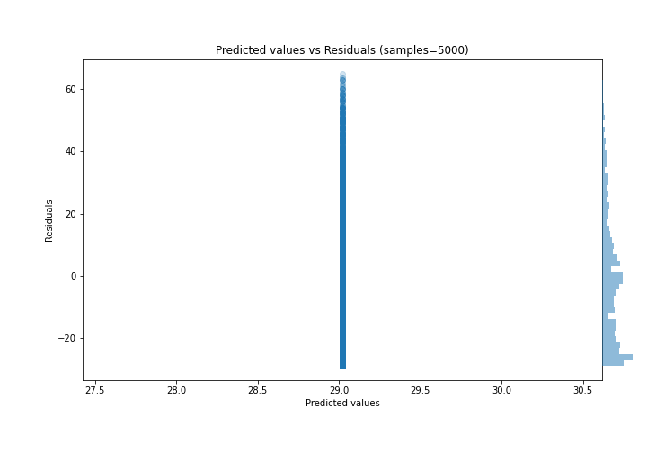

# Summary of 1_Baseline

[<< Go back](../README.md)

## Baseline Regressor (Baseline)
- **n_jobs**: -1
- **explain_level**: 2

## Validation
 - **validation_type**: split
 - **train_ratio**: 0.75
 - **shuffle**: True

## Optimized metric
rmse

## Training time

0.8 seconds

### Metric details:
| Metric   |         Score |
|:---------|--------------:|
| MAE      |  15.7068      |
| MSE      | 396.657       |
| RMSE     |  19.9162      |
| R2       |  -0.000132579 |
| MAPE     |   1.57886e+15 |

## Learning curves

## True vs Predicted

## Predicted vs Residuals

[<< Go back](../README.md)
