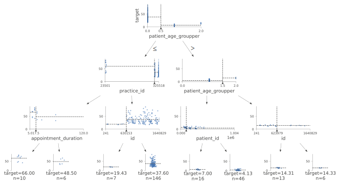
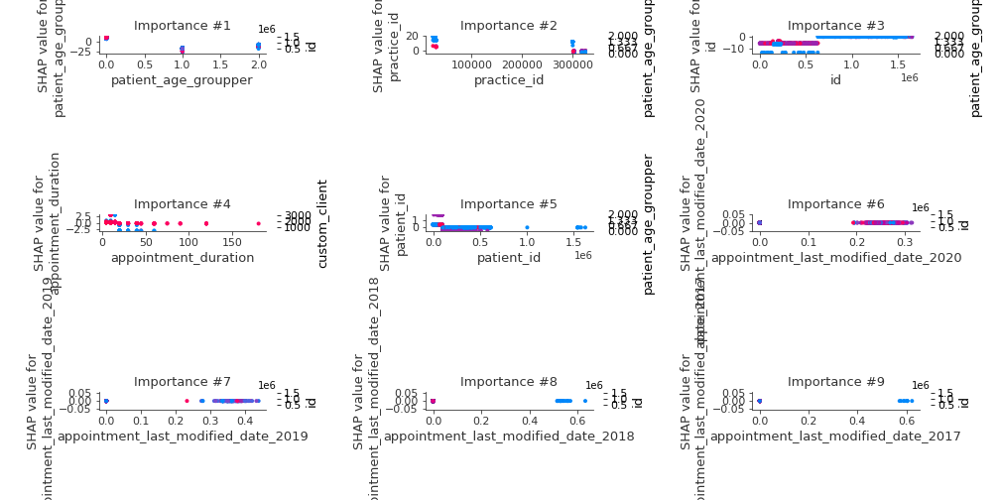

# Summary of 2_DecisionTree

[<< Go back](../README.md)

## Decision Tree
- **n_jobs**: -1
- **criterion**: mse
- **max_depth**: 3
- **explain_level**: 2

## Validation
 - **validation_type**: split
 - **train_ratio**: 0.75
 - **shuffle**: True

## Optimized metric
rmse

## Training time

82.1 seconds

### Metric details:
| Metric   |         Score |
|:---------|--------------:|
| MAE      |   8.87349     |
| MSE      | 159.633       |
| RMSE     |  12.6346      |
| R2       |   0.597501    |
| MAPE     |   1.97625e+14 |

## Learning curves

## Decision Tree 

### Tree #1

### Rules

if (patient_age_groupper <= 0.5) and (practice_id > 301251.5) and (id > 630153.0) then response: 37.76 | based on 43,883 samples

if (patient_age_groupper > 0.5) and (patient_age_groupper <= 1.5) and (patient_id > 99583.0) then response: 3.633 | based on 12,449 samples

if (patient_age_groupper > 0.5) and (patient_age_groupper > 1.5) and (id <= 623979.0) then response: 14.396 | based on 4,877 samples

if (patient_age_groupper > 0.5) and (patient_age_groupper <= 1.5) and (patient_id <= 99583.0) then response: 7.619 | based on 4,145 samples

if (patient_age_groupper <= 0.5) and (practice_id <= 301251.5) and (appointment_duration > 17.5) then response: 44.068 | based on 3,161 samples

if (patient_age_groupper <= 0.5) and (practice_id <= 301251.5) and (appointment_duration <= 17.5) then response: 56.702 | based on 3,045 samples

if (patient_age_groupper <= 0.5) and (practice_id > 301251.5) and (id <= 630153.0) then response: 19.955 | based on 1,889 samples

if (patient_age_groupper > 0.5) and (patient_age_groupper > 1.5) and (id > 623979.0) then response: 14.772 | based on 1,551 samples

## Permutation-based Importance

## True vs Predicted

## Predicted vs Residuals

## SHAP Importance

## SHAP Dependence plots

### Dependence (Fold 1)

## SHAP Decision plots

### Top-10 Worst decisions (Fold 1)

### Top-10 Best decisions (Fold 1)

[<< Go back](../README.md)
