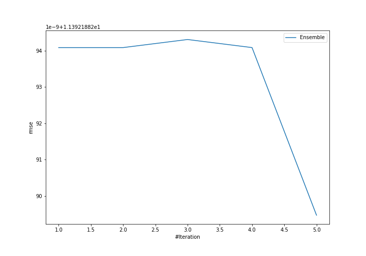
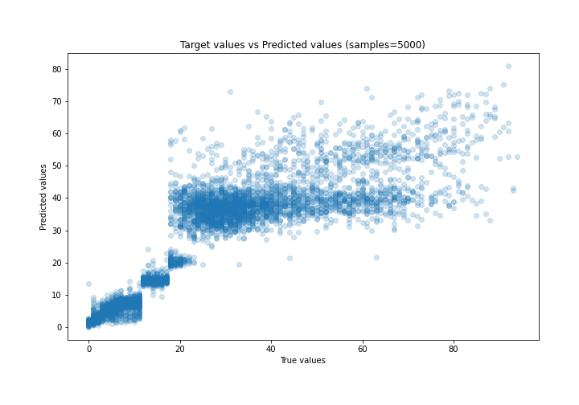
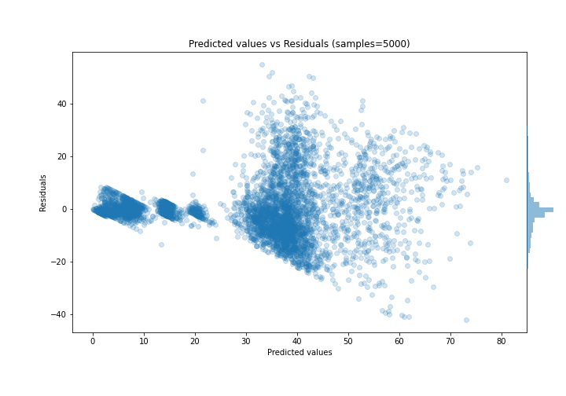

# Summary of Ensemble

[<< Go back](../README.md)

## Ensemble structure
| Model             |   Weight |
|:------------------|---------:|
| 3_Default_Xgboost |        5 |

### Metric details:
| Metric   |         Score |
|:---------|--------------:|
| MAE      |   7.82877     |
| MSE      | 129.782       |
| RMSE     |  11.3922      |
| R2       |   0.672767    |
| MAPE     |   9.38887e+13 |

## Learning curves

## True vs Predicted

## Predicted vs Residuals

[<< Go back](../README.md)
